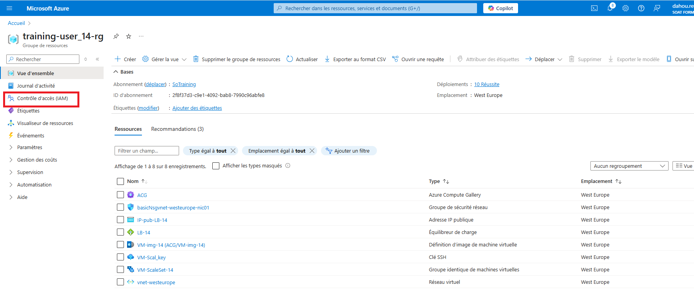
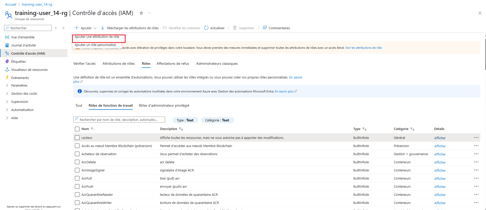
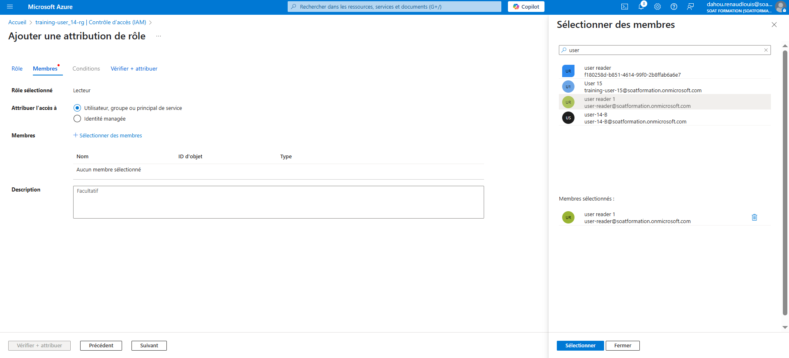
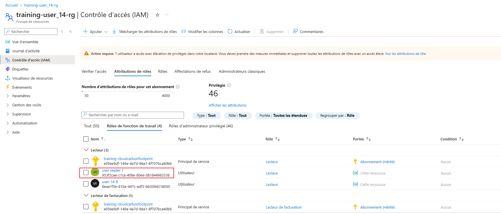

### Objectifs du TP :
- Comprendre les rôles intégrés et leur attribution dans Azure.
- Apprendre à contrôler les accès par niveaux (souscription, groupe de ressources, ressource).
- Mettre en place un groupe d'utilisateur avec un rôle  reader sur un groupe de ressource.

---

### Prérequis :
- Un abonnement Azure actif.
- Une machine virtuelle Azure.
- Accès au portail Azure (Azure Portal).
- Connaissances de base sur les concepts de contrôle des accès (IAM - Identity and Access Management).

**Autoriser un utilisateur à effectuer des action sur un groupe de ressource** :

NB: l'utilisateur à unique ment des autorisation en lecture seule sur ce ressouce groupe
