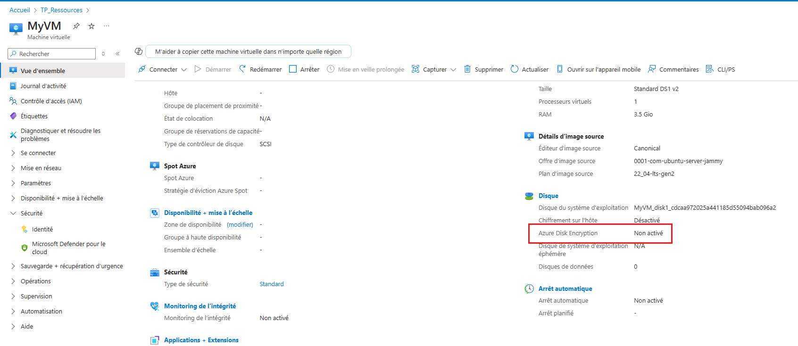
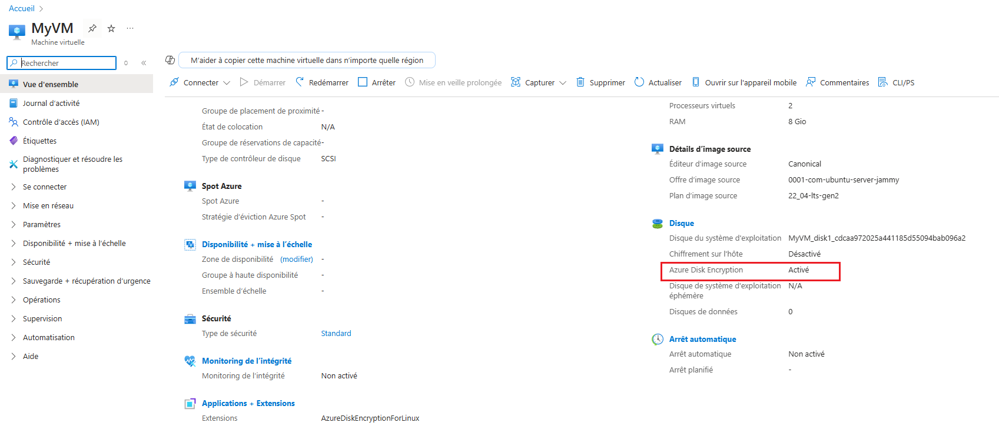

Le **chiffrement des disques de machines virtuelles** (VM) dans Azure est une mesure de sécurité cruciale qui permet de protéger les données en cas de vol ou de compromission des disques. Ce chiffrement peut être effectué à l'aide de **Azure Key Vault** en utilisant des clés de chiffrement.

### Types de coffres de clés dans Azure :
1. **Coffre de clés Standard (Software-protected keys)** :
   - Les clés de chiffrement sont gérées par **Azure** elle-même.
   - Ce type de coffre de clés utilise des protections logicielles pour gérer les clés de chiffrement.
   - C'est un choix économique et suffisant pour de nombreuses situations.
   
2. **Coffre de clés Premium (HSM-protected keys)** :
   - Ce type utilise des **modules de sécurité matériels** (HSM - Hardware Security Module) pour protéger les clés de chiffrement.
   - Ce type de coffre est plus sécurisé, car il offre une gestion plus robuste des clés et une protection contre les menaces physiques.

### Configuration de la sécurité des disques de VM via Key Vault :

#### 1. **Activer le chiffrement des disques de la machine virtuelle**
Azure offre plusieurs mécanismes pour activer le chiffrement des disques des machines virtuelles. Voici les étapes de base pour configurer cela :

##### a. **Activer Azure Disk Encryption (ADE)** pour les disques de la machine virtuelle

1. **Créer un coffre de clés Azure** :
   - Le coffre de clés peut être de type standard ou premium en fonction du niveau de sécurité requis.
   - Le coffre doit être configuré pour stocker les clés de chiffrement utilisées pour les disques de la VM.

   ```bash
   az keyvault create --name <keyvault-name> --resource-group <resource-group> --location <region>

   az keyvault create --name "MyKeyVaultrenaud" --resource-group TP_Ressources --location westeurope
   ```

2. **Créer une clé dans le coffre de clés** :
   - Vous devez créer une clé dans le coffre de clés que vous utiliserez pour le chiffrement.

   ```bash
   az keyvault key create --vault-name <keyvault-name> --name <key-name> --protection software
az keyvault key create --vault-name "MyKeyVaultrenaud" --name myencryptkeyrenaud --protection software
   ```

   Ou, pour un coffre Premium (HSM) :
   ```bash
   az keyvault key create --vault-name <keyvault-name> --name <key-name> --protection hsm
   ```

3. **Configurer la VM pour utiliser le chiffrement des disques** :
   Vous devez associer la clé de chiffrement au disque de la VM via la commande `az vm encryption enable`. Cela permet d'activer le chiffrement pour les disques de la machine virtuelle.

```bash

az vm create --name MyVM --resource-group {resource-group-name} --image UbuntuLTS  --admin-username azureuser --ssh-key-values 

az vm create --resource-group TP_Ressources --name MyVM --image Ubuntu2204 --admin-username azureuser --ssh-key-values "ssh-rsa AAAAB3NzaC1yc2EAAAADAQABAAABgQCXhkjJATVZ4gwS+cfk3UuUO3sY1J3NDuDOElTDicaAgAA6STmOIyhYMzjP0Cp0W7zhaXo9xHsCPJBGRSMH0I1ZtaqrGFQV43J7eOsrZ2bdzqCsbj8qstxxMigfaZ4ds9DSE8Od/KflNx/SWlgPCps8gJAfDtzvrmnbUB88h25ZboVHODkpeb3BhqeoNrG+qZ4bypgVqv8A/FpUqM/Tse43Tt743kY2KdF2HBHbXGfpHshtfTOI09qY77O6Ua3ew/ZyhoVUtBstQuhZZj67gqOt4aZS7iiqaxvFvpr7PWnqc7iHZfUGsh5HrBepwobod3ONneieLZypLBE6V6xTq7pHqa8eFVCZZtxCBk8tHIPd9WBxxvbsope1SOl5vbSjr2+iB6lL4We+PRUyuvyYZZIfpu+JECbYYOoef4uDgvpTnKRBTm4FsUwsFsArSnvdSuMxTUz7V3bVTYJxJuDRf0qxxeJI541yCMFjUWUpwY/uu8n9qFBUEeytzSXDI/fvyi0= generated-by-azure" --size Standard_DS1_v2

Activez l'identité managée pour cette machine virtuelle :
az vm identity assign --name MyVM --resource-group  TP_Ressources

Attribuer l'acces au vault
az keyvault set-policy --name "MyKeyVaultrenaud" --object-id {object-id} --key-permissions get

az keyvault set-policy --name "MyKeyVaultrenaud" --object-id 042b7a29-18f5-41b7-aa84-5586b1983ba6 --key-permissions get


````



```

Activer le chiffrement des disques sur le Key Vault:
az keyvault update --name MyKeyVaultrenaud --resource-group TP_Ressources --enabled-for-disk-encryption true

verification:
az keyvault show --name MyKeyVaultrenaud --query "properties.enabledForDiskEncryption"


az vm encryption enable --resource-group <resource-group> --name <vm-name> --disk-encryption-keyvault <keyvault-name> --key-encryption-key <key-name>

az vm encryption enable --resource-group TP_Ressources --name MyVM --disk-encryption-keyvault MyKeyVaultrenaud --key-encryption-key myencryptkeyrenaud


Bug de Memoire RAM: Si possible, changez la taille de la VM pour qu'elle ait au moins 8 Go de RAM et relancer

az vm resize --resource-group TP_Ressources --name MyVM --size Standard_D2s_v3

az vm encryption enable --resource-group TP_Ressources --name MyVM --disk-encryption-keyvault MyKeyVaultrenaud --key-encryption-key myencryptkeyrenaud

   ```




   Cela permettra de chiffrer tous les disques attachés à la machine virtuelle avec la clé spécifiée dans le coffre de clés.

##### b. **Vérifier l'état de l'encryption** :
   Une fois le chiffrement activé, vous pouvez vérifier l'état des disques encryptés via la commande suivante :

   ```bash
   az vm encryption show --resource-group <resource-group> --name <vm-name>
   ```

#### 2. **Protection avec des clés HSM (Coffre de clés Premium)**
Si vous choisissez d'utiliser un **coffre de clés Premium** pour le chiffrement matériel sécurisé (HSM), les étapes de base sont les mêmes, mais vous devez spécifier l'option `--protection hsm` lors de la création de la clé.

Cela ajoute une couche de sécurité supplémentaire en s'appuyant sur des modules matériels pour protéger les clés de chiffrement.

### Récapitulatif des étapes de configuration :
1. Créer un coffre de clés Azure.
2. Créer une clé de chiffrement (choisir le type Standard ou Premium).
3. Activer le chiffrement pour les disques de la machine virtuelle en associant la clé au disque via `az vm encryption enable`.

### Avantages du chiffrement des disques de la VM dans Azure :
- **Protection des données sensibles** : Le chiffrement protège les données même en cas d'accès non autorisé aux disques de la VM.
- **Conformité** : Le chiffrement est souvent requis pour se conformer aux réglementations telles que le RGPD, HIPAA, etc.
- **Sécurité renforcée avec HSM** : Si vous optez pour le coffre de clés Premium, la sécurité des clés est renforcée par un matériel dédié, ce qui protège mieux contre les attaques physiques.

### Conclusion :
Le chiffrement des disques de VM dans Azure est une excellente manière de renforcer la sécurité des données en utilisant les clés gérées par Azure Key Vault. Vous pouvez choisir entre une protection logicielle (Standard) ou matérielle (Premium avec HSM), en fonction de vos besoins en matière de sécurité.