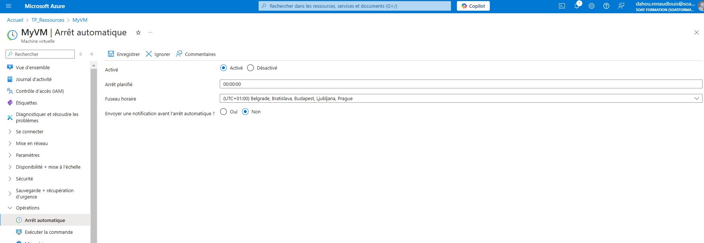

## **1️⃣ Activer l'arrêt automatique (Auto-Shutdown)**  

Azure permet de planifier l'arrêt automatique d'une VM avec **Auto-Shutdown**.  

### **Méthode via Azure CLI**
```powershell
az vm auto-shutdown --resource-group TP_Ressources --name MyVM --time 17:55
```
📌 **Remplace `23:00` par l'heure souhaitée** (UTC).

### **Méthode via le Portail Azure**
1. Aller dans **"Machines Virtuelles"** > Sélectionner ta VM.
2. Aller dans **"Auto-shutdown"** (dans le menu à gauche).
3. Activer et définir l'heure d'arrêt.

---

## **2️⃣ Planifier un Redémarrage Automatique**
Azure ne propose pas directement un "Auto-Start", mais tu peux utiliser **Azure Automation** ou une **fonction Logic Apps** pour démarrer ta VM à une heure spécifique.

### **Méthode via Azure CLI**
Planifier un **redémarrage quotidien** avec `az vm start` et `az vm deallocate` via une **tâche cron** sous Windows/Linux.

#### **Sur une machine Windows avec le Planificateur de tâches :**
1. Ouvre le **Planificateur de tâches Windows**.
2. Crée une nouvelle tâche avec :
   - **Action :** Lancer un programme
   - **Programme :** `powershell.exe`
   - **Arguments :**  
     ```powershell
     az vm start --resource-group TP_Ressources --name MyVM
     ```

#### **Sur Linux (avec cron) :**
1. Ouvre le cron :  
   ```bash
   crontab -e
   ```
2. Ajoute une ligne pour démarrer la VM à 07:00 UTC chaque jour :  
   ```bash
   0 7 * * * az vm start --resource-group TP_Ressources --name MyVM
   ```

---

## **3️⃣ Automatiser avec Azure Automation**
Si tu veux un redémarrage automatique **directement depuis Azure**, crée un **runbook Azure Automation**.

1. **Créer un compte Azure Automation**
   ```powershell
   az automation account create --name AutoVMAccount --resource-group TP_Ressources --location westeurope
   ```

2. **Créer un runbook PowerShell pour démarrer la VM**
   ```powershell
   New-AzAutomationRunbook -ResourceGroupName TP_Ressources -AutomationAccountName AutoVMAccount -Name "StartMyVM" -Type PowerShell
   ```

3. **Ajouter le script PowerShell suivant :**

   ```powershell
   param (
       [string]$resourceGroupName = "TP_Ressources",
       [string]$vmName = "MyVM"
   )

   $vm = Get-AzVM -ResourceGroupName $resourceGroupName -Name $vmName
   Start-AzVM -ResourceGroupName $resourceGroupName -Name $vmName -Force
   ```

4. **Planifier l'exécution du Runbook**
   - Dans **Azure Automation**, aller dans **Runbooks** > **"StartMyVM"**.
   - Cliquer sur **Planifier une exécution**.
   - Définir l'heure de démarrage.

---

## **🎯 Résumé :**
- **Auto-shutdown :** `az vm auto-shutdown --resource-group TP_Ressources --name MyVM --time HH:MM`
- **Auto-start :** Utiliser **Azure Automation**, une tâche **cron**, ou le **Planificateur de tâches Windows** avec `az vm start`.

