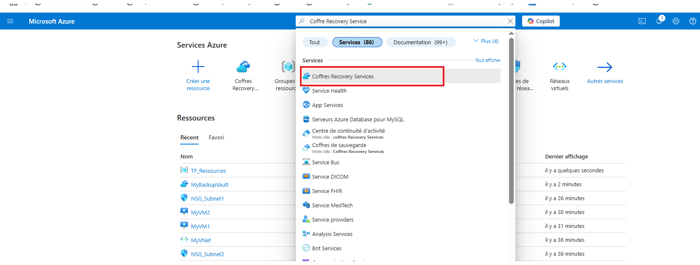
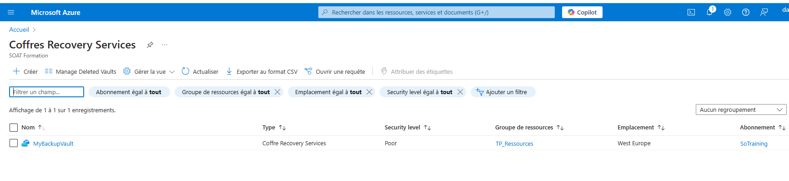
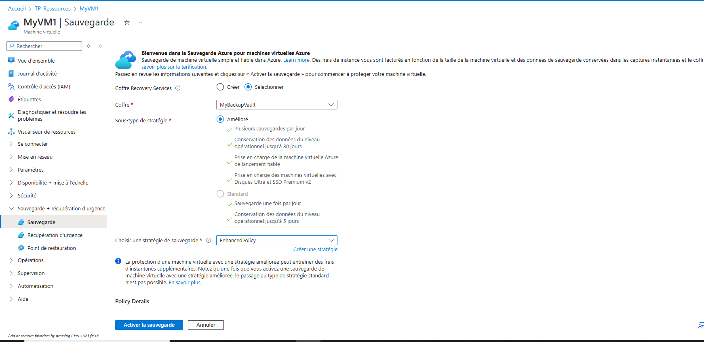
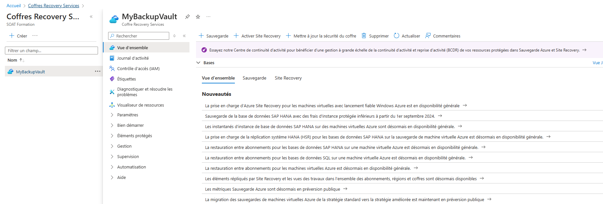
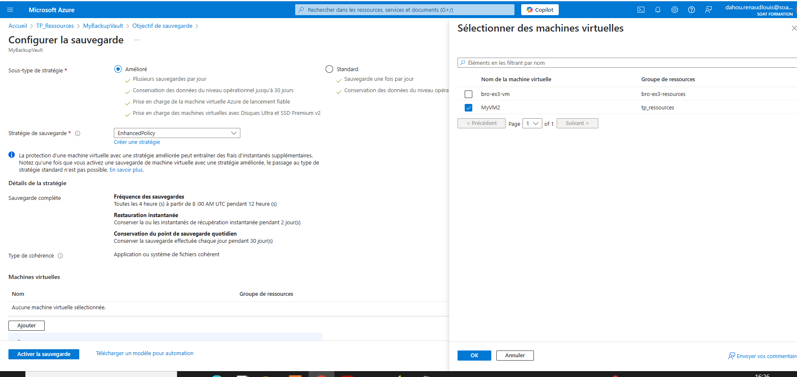
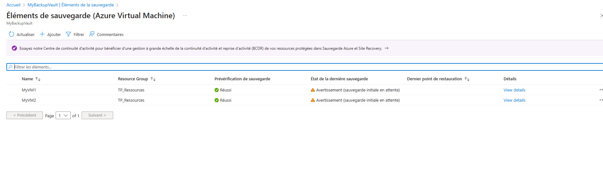

### Étape 1 : Prérequis

Avant de commencer, assure-toi que tu as les éléments suivants :
1. Un **compte Azure actif**.
2. **Azure CLI** installé (ou **Azure PowerShell**).
3. Un **groupe de ressources** pour les ressources Azure.
4. Une **machine virtuelle** à sauvegarder.

### Étape 2 : Créer un coffre de sauvegarde

#### Créer un coffre de sauvegarde à partir de l'interface Azure

1. Connecte-toi au portail Azure.
2. Recherche **"Backup"** dans la barre de recherche.
3. Sélectionne **"Backup Center"** puis clique sur **"Create a backup vault"**.
4. Remplis les informations nécessaires :
   - Nom du coffre de sauvegarde.
   - Abonnement et groupe de ressources.
   - Région de ton choix (assure-toi qu'elle est proche de tes autres ressources).

5. Clique sur **"Review + Create"** puis **"Create"**.

#### Créer un coffre de sauvegarde via Azure CLI
Si tu préfères utiliser Azure CLI, tu peux créer un coffre de sauvegarde avec cette commande :

```bash
az backup vault create `
  --resource-group TP_Ressources `
  --name MyBackupVault `
  --location westeurope
```

### Étape 3 : Configurer la machine virtuelle pour la sauvegarde

#### Préparer la machine virtuelle pour la sauvegarde
1. Sur le portail Azure, accède à la machine virtuelle que tu souhaites sauvegarder.
2. Dans la section **"Backup"**, clique sur **"Enable backup"**.
3. Sélectionne le coffre de sauvegarde que tu viens de créer.
4. Sélectionne l’option de **"Retain backups"** selon la politique de rétention que tu souhaites.
5. Clique sur **"Enable Backup"** pour activer la sauvegarde de ta machine virtuelle.


### Étape 4 : Effectuer une sauvegarde




.

### Étape 5 : Vérifier la sauvegarde

Tu peux vérifier l'état de la sauvegarde dans le portail Azure, sous la section **Backup** de ta machine virtuelle.

Via Azure CLI, tu peux également lister les sauvegardes de la VM :

```bash
az backup item list `
  --resource-group TP_Ressources `
  --vault-name MyBackupVault `
  --backup-management-type AzureIaasVM
```

### Étape 6 : Restaurer une machine virtuelle à partir de la sauvegarde

#### Restaurer via le portail Azure

1. Dans le portail Azure, accède au coffre de sauvegarde.
2. Sélectionne la machine virtuelle à restaurer.
3. Clique sur **"Restore VM"** et choisis la sauvegarde à restaurer.
4. Configure les options de restauration (par exemple, restaurer la VM sur un autre réseau, ou la restaurer à un état spécifique).
5. Clique sur **"Restore"** pour lancer la restauration.

#### Restaurer via Azure CLI

Pour restaurer la machine virtuelle, tu peux utiliser la commande suivante :

```bash
az backup restore restore-azurevm `
  --resource-group TP_Ressources `
  --vault-name MyBackupVault `
  --vm-name MyVM2 `
  --restore-to-original-vm true


az backup restore restore-azurevm \
  --resource-group TP_Ressources  \
  --vault-name MyBackupVault  \
  --vm-name MyVM2  \
  --restore-to-original-vm true
```

Ici, tu peux spécifier si tu veux restaurer la VM à son état original ou vers un autre emplacement.

### Étape 7 : Vérification après la restauration

Tu peux vérifier l'état de la machine virtuelle après la restauration pour t'assurer qu'elle fonctionne comme prévu.

```bash
az vm show --resource-group TP_Ressources --name MyVM2
```

