### ``INSTRUCTION``


### ``* Créez  le groupe de ressource training-votrenom-rg``


### ``* Créez votre première ressource  dans le groupe de ressource training-votrenom-rg``

### ``* Cette ressource  est un VM Ubuntu qui aura pour nom VMrelease``

### ``* Pour vous guider, suivez les exemples ci-dessous.``

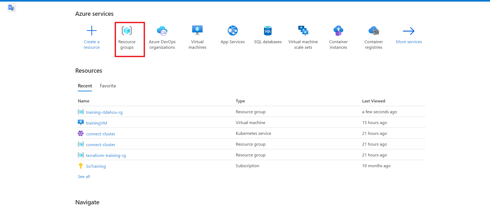
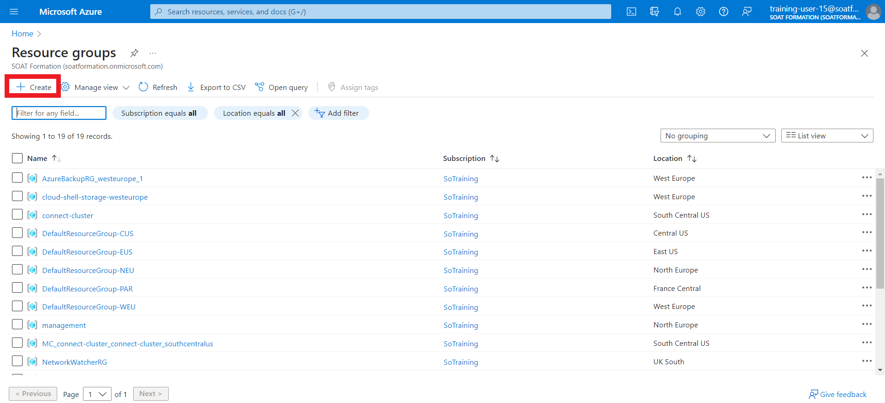
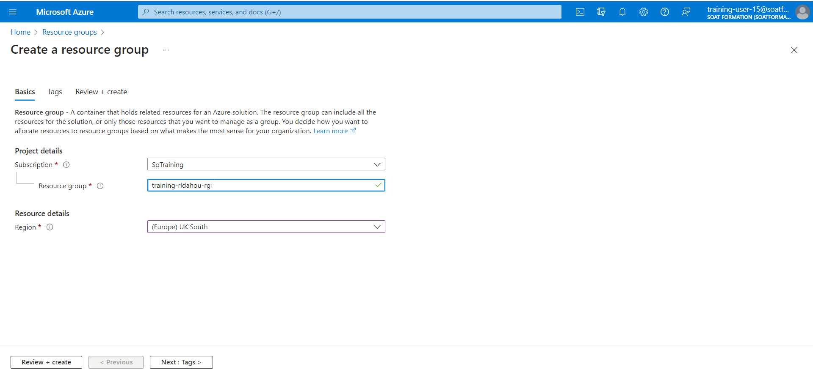

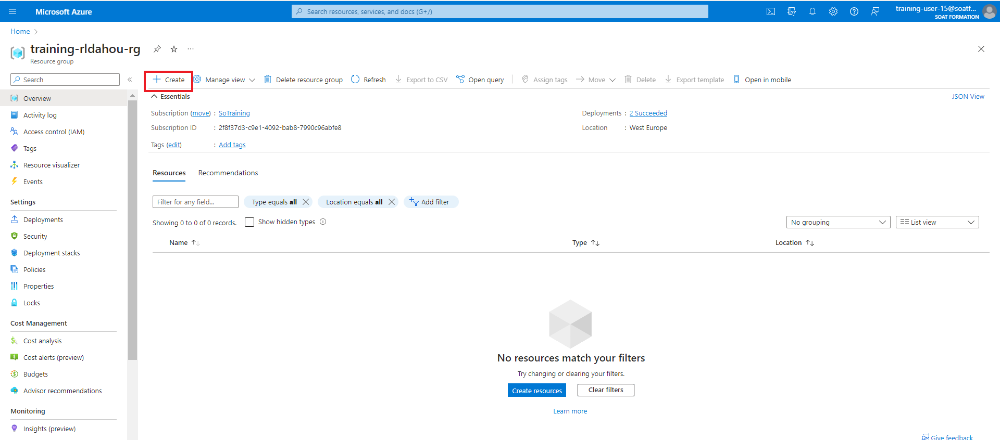

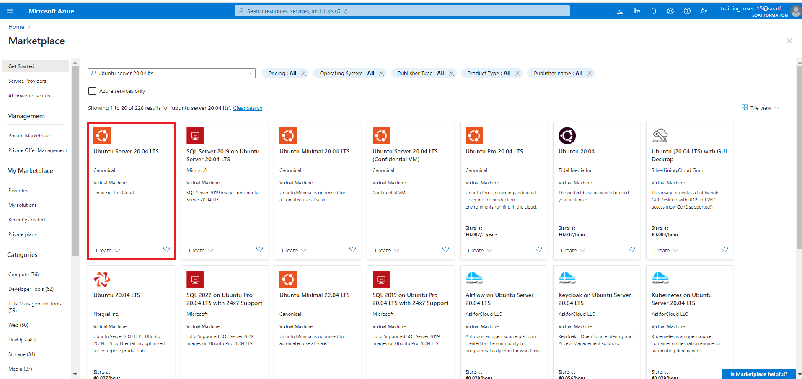

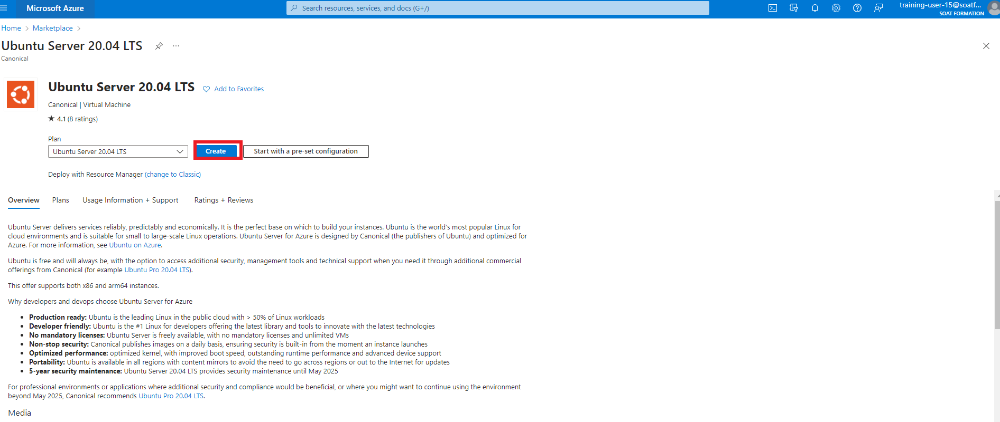

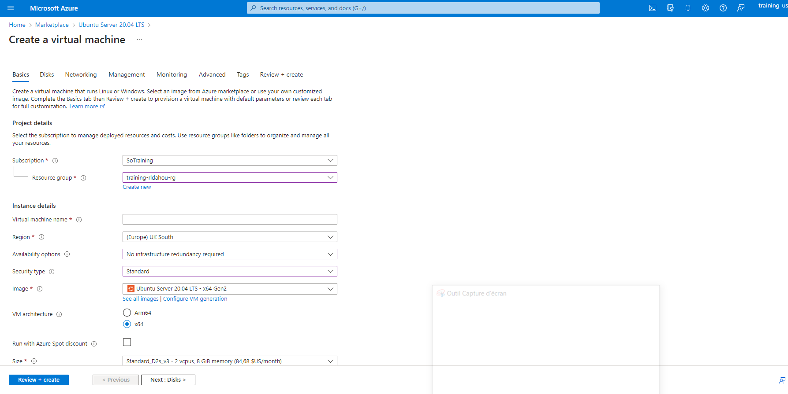

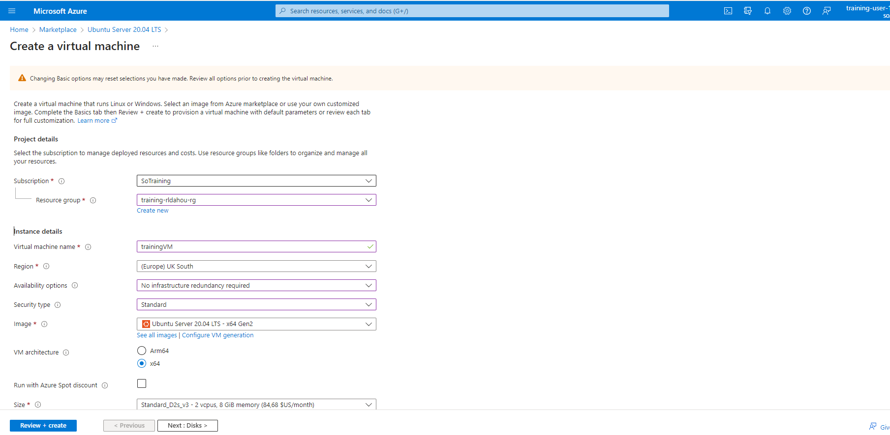

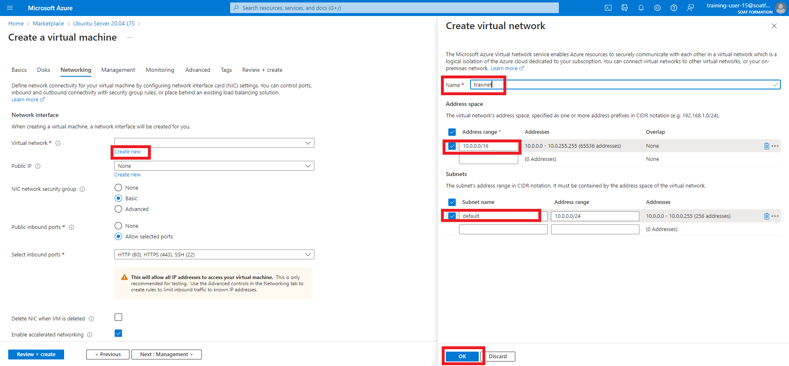

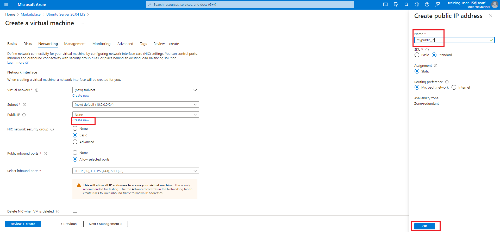


```python

```

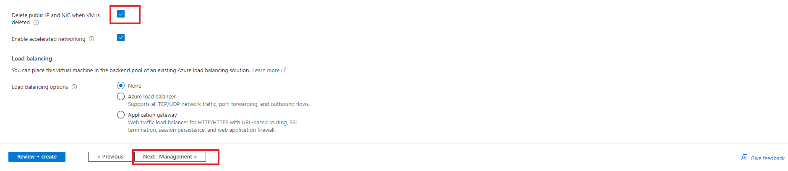

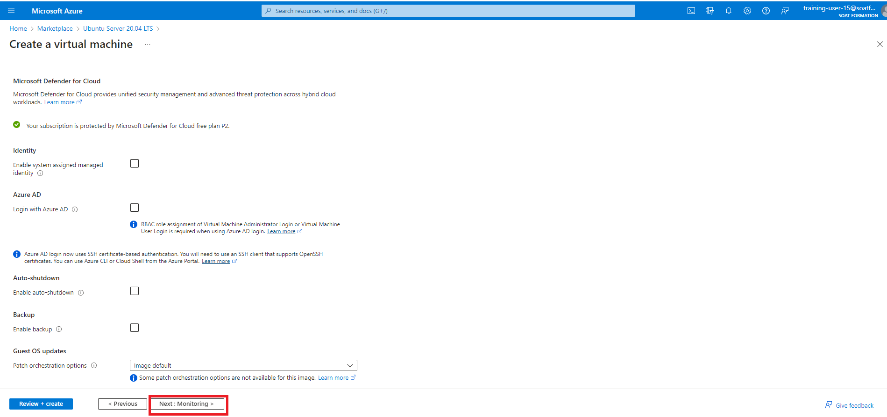

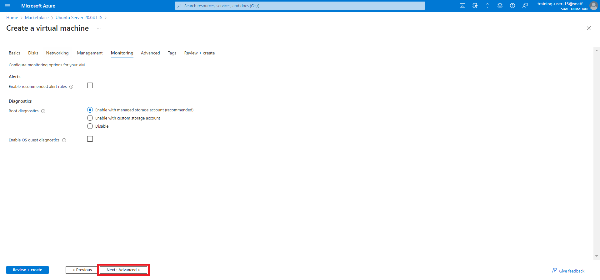

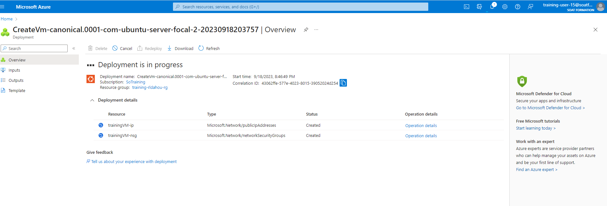

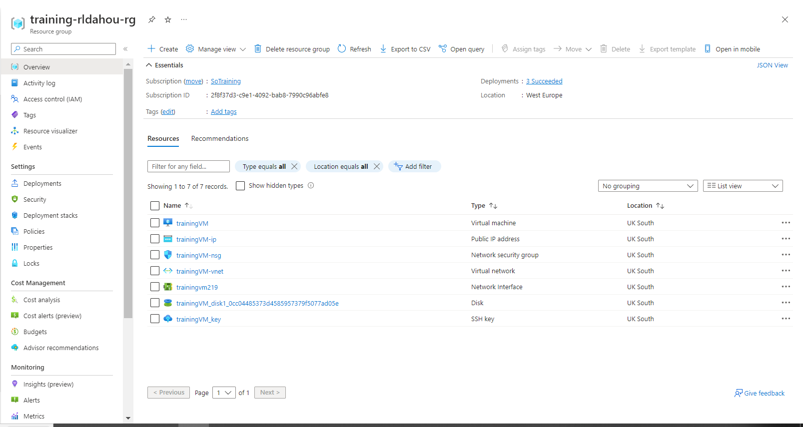

#### seconnecter à la VM

`` ssh -i trainingVM_key.pem azureuser@IP_public``


```python

```

### Générer un tamplate à partir de son groupe de ressources


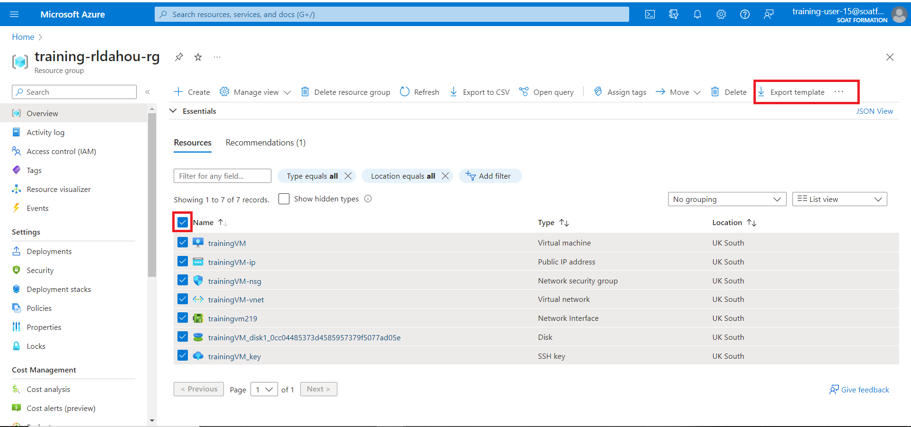

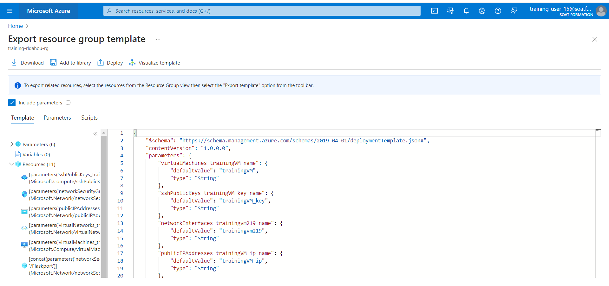

### ``Pour en Savoir plus``

Template 

https://github.com/renauddahou/azure-quickstart-templates


How to deploy

Azure CLI or Powershell is recommended to deploy the template.

Using Azure CLI
https://azure.microsoft.com/en-us/documentation/articles/xplat-cli-azure-resource-manager/

Using Powershell
https://azure.microsoft.com/en-us/documentation/articles/powershell-azure-resource-manager/


Créate template with vscode

https://learn.microsoft.com/en-us/azure/azure-resource-manager/templates/quickstart-create-templates-use-visual-studio-code?tabs=PowerShell


```python

```
