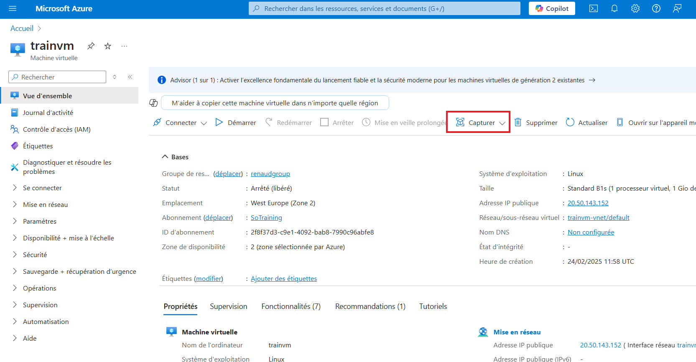
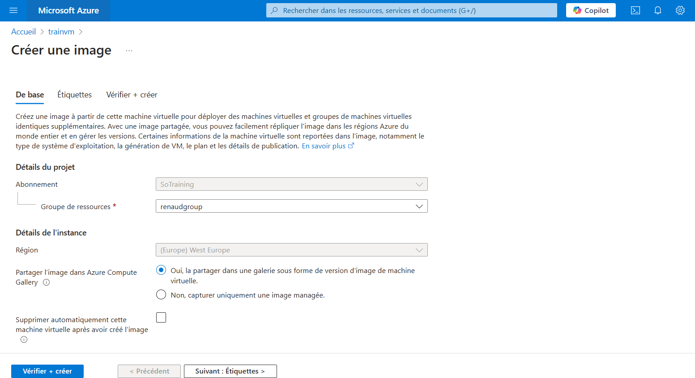
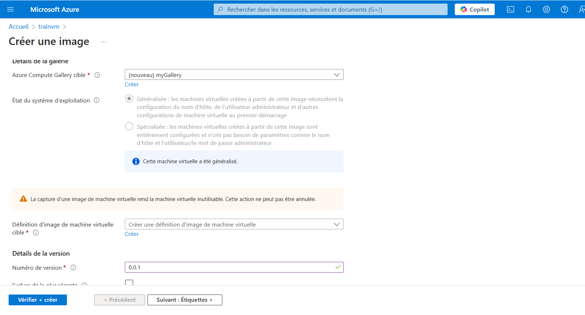
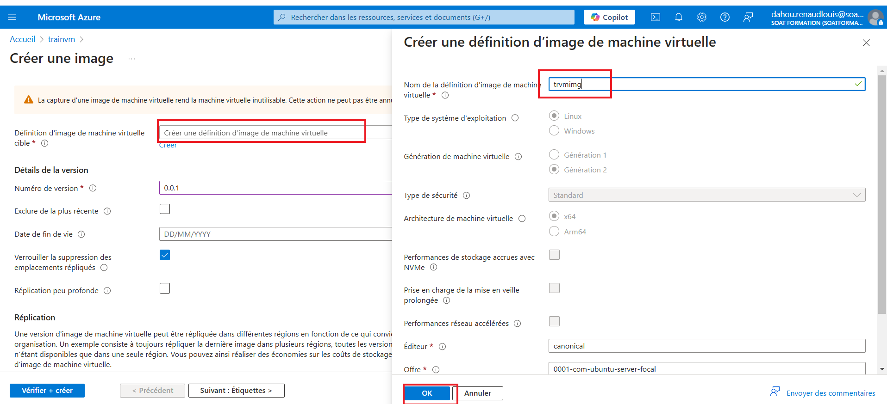
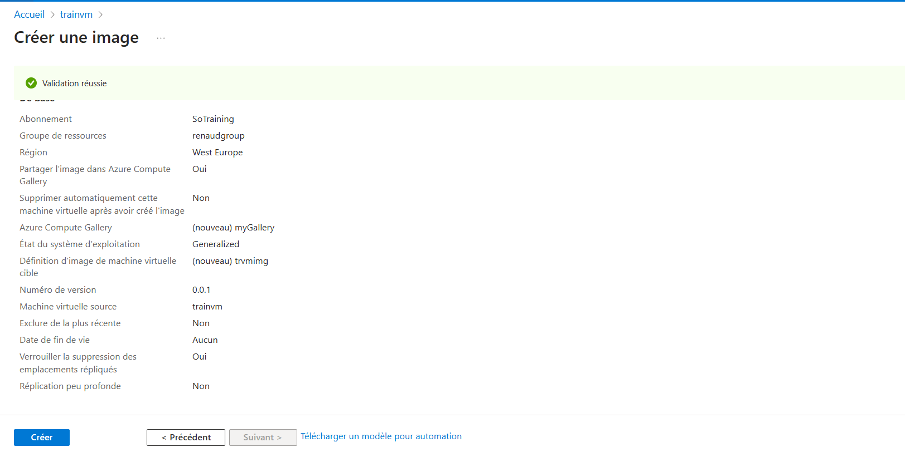

####L'idée ici est de capturer une image personnalisée de la VM pour la réutiliser et la partager donc on va  généraliser la VM avec la commande ci-dessous.

```
######### Installer sur la VM et Puis arrêter la VM
sudo waagent -deprovision+user
````
````
az vm deallocate --resource-group renaudgroup --name trainvm
az vm generalize --resource-group renaudgroup --name trainvm
````


####Capturer l’image depuis le portail et création de l'image 


# --------------------------------------

# --------------------------------------


# --------------------------------------



# --------------------------------------



# création de ressource à partir de l'image partager

````
###voir les différentes versions existantes
az sig image-version list  --gallery-name MySharedGallery  --resource-group renaudgroup --gallery-image-definition trainnm_image --output table

az vm create \
  --resource-group <nom-du-resource-group> \
  --name <nom-de-la-vm> \
  --image "/subscriptions/<id-subscription>/resourceGroups/<nom-du-resource-group>/providers/Microsoft.Compute/galleries/<nom-de-la-galerie>/images/<nom-de-l-image>/versions/latest" \
  --admin-username azureuser \
  --ssh-key-values ~/.ssh/my_azure_key.pub


az vm create --resource-group renaudgroup --name trainvm2 --image "/subscriptions/2f8f37d3-c9e1-4092-bab8-7990c96abfe8/resourceGroups/renaudgroup/providers/Microsoft.Compute/galleries/MySharedGallery/images/trainnm_image/versions/0.0.2" --admin-username "azureuser" --ssh-key-values "ssh-rsa AAAAB3NzaC1yc2EAAAADAQABAAABgQCXhkjJATVZ4gwS+cfk3UuUO3sY1J3NDuDOElTDicaAgAA6STmOIyhYMzjP0Cp0W7zhaXo9xHsCPJBGRSMH0I1ZtaqrGFQV43J7eOsrZ2bdzqCsbj8qstxxMigfaZ4ds9DSE8Od/KflNx/SWlgPCps8gJAfDtzvrmnbUB88h25ZboVHODkpeb3BhqeoNrG+qZ4bypgVqv8A/FpUqM/Tse43Tt743kY2KdF2HBHbXGfpHshtfTOI09qY77O6Ua3ew/ZyhoVUtBstQuhZZj67gqOt4aZS7iiqaxvFvpr7PWnqc7iHZfUGsh5HrBepwobod3ONneieLZypLBE6V6xTq7pHqa8eFVCZZtxCBk8tHIPd9WBxxvbsope1SOl5vbSjr2+iB6lL4We+PRUyuvyYZZIfpu+JECbYYOoef4uDgvpTnKRBTm4FsUwsFsArSnvdSuMxTUz7V3bVTYJxJuDRf0qxxeJI541yCMFjUWUpwY/uu8n9qFBUEeytzSXDI/fvyi0= generated-by-azure"

````
