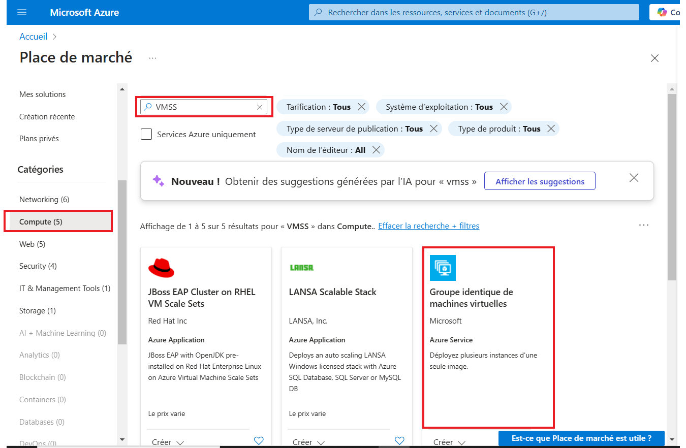
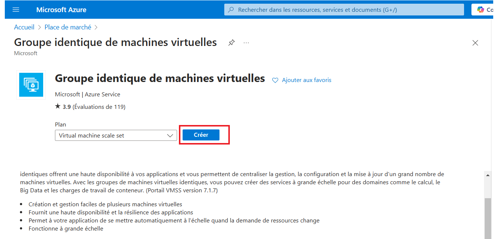
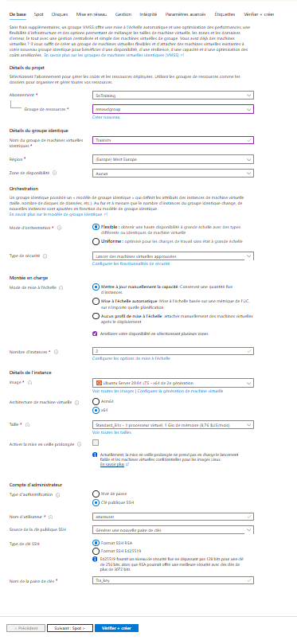

Le VMSS permet de déployer plusieurs instances de VM et de gérer automatiquement l'évolutivité.  

### **Principaux changements apportés :**
1. **Modification du type** : `Microsoft.Compute/virtualMachines` → `Microsoft.Compute/virtualMachineScaleSets`
2. **Ajout de `sku` et `capacity`** : Définition du nombre d'instances initiales.
3. **Changement de `properties.virtualMachineProfile`** : Remplace `properties` des VM individuelles par un profil de VM.
4. **Ajout de `upgradePolicy`** : Définit la mise à jour des instances.
5. **Modification des références réseau** : Utilisation d'un **Load Balancer** ou d'un **Network Interface Configuration**.

````
        {
            "type": "Microsoft.Network/loadBalancers",
            "apiVersion": "2024-03-01", // Version API plus récente
            "name": "loadBalancerExternal", // Nom dédié au Load Balancer
            "location": "westeurope",
            "sku": {
                "name": "Standard"
            },
            "dependsOn": [
                "[resourceId('Microsoft.Network/publicIPAddresses', parameters('publicIPAddresses_alb_ip_925b10fc_name'))]"
            ],
            "properties": {
                "frontendIPConfigurations": [
                    {
                        "name": "LoadBalancerFrontEnd",
                        "properties": {
                            "publicIPAddress": {
                                "id": "[resourceId('Microsoft.Network/publicIPAddresses', parameters('publicIPAddresses_alb_ip_925b10fc_name'))]"
                            }
                        }
                    }
                ],
                "backendAddressPools": [
                    {
                        "name": "backendpool"
                    }
                ],
                "inboundNatRules": [
                    {
                        "name": "natRule1",
                        "properties": {
                            "frontendIPConfiguration": {
                                "id": "[resourceId('Microsoft.Network/loadBalancers/frontendIPConfigurations', 'loadBalancerExternal', 'loadBalancerFrontEnd')]"
                            },
                            "protocol": "Tcp",
                            "frontendPort": 2222,
                            "backendPort": 22,
                            "enableFloatingIP": false
                        }
                    }
                ],
                "loadBalancingRules": [
                    {
                        "name": "LBRule1",
                        "properties": {
                            "frontendIPConfiguration": {
                                "id": "[resourceId('Microsoft.Network/loadBalancers/frontendIPConfigurations', 'loadBalancerExternal', 'loadBalancerFrontEnd')]"
                            },
                            "backendAddressPool": {
                                "id": "[resourceId('Microsoft.Network/loadBalancers/backendAddressPools', 'loadBalancerExternal', 'backendpool')]"
                            },
                            "protocol": "Tcp",
                            "frontendPort": 80,
                            "backendPort": 80,
                            "enableFloatingIP": false,
                            "idleTimeoutInMinutes": 5,
                            "probe": {
                                "id": "[resourceId('Microsoft.Network/loadBalancers/probes', 'loadBalancerExternal', 'tcpProbe')]"
                            }
                        }
                    }
                ],
                "probes": [
                    {
                        "name": "tcpProbe1",
                        "properties": {
                            "protocol": "Tcp",
                            "port": 80,
                            "intervalInSeconds": 5,
                            "numberOfProbes": 2
                        }
                    }
                ]
            }
        },
        {
            "type": "Microsoft.Compute/virtualMachineScaleSets",
            "apiVersion": "2024-07-01",
            "name": "[parameters('virtualMachines_trainvm_name')]",
            "location": "westeurope",
            "dependsOn": [
                "[resourceId('Microsoft.Network/loadBalancers', 'loadBalancerExternal')]", // Added dependency
                "[resourceId('Microsoft.Network/virtualNetworks', parameters('virtualNetworks_trainvm_vnet_name'))]"
            ],
            "sku": {
                "name": "Standard_B1s",
                "tier": "Standard",
                "capacity": 2
            },
            "properties": {
                "upgradePolicy": {
                    "mode": "Manual"
                },
                "virtualMachineProfile": {
                    "storageProfile": {
                        "imageReference": {
                            "publisher": "canonical",
                            "offer": "0001-com-ubuntu-server-focal",
                            "sku": "20_04-lts-gen2",
                            "version": "latest"
                        },
                        "osDisk": {
                            "createOption": "FromImage",
                            "managedDisk": {
                                "storageAccountType": "Premium_LRS"
                            },
                            "caching": "ReadWrite",
                            "diskSizeGB": 30
                        },
                        "dataDisks": []
                    },
                    "osProfile": {
                        "computerNamePrefix": "[parameters('virtualMachines_trainvm_name')]",
                        "adminUsername": "azureuser",
                        "linuxConfiguration": {
                            "disablePasswordAuthentication": true,
                            "ssh": {
                                "publicKeys": [
                                    {
                                        "path": "/home/azureuser/.ssh/authorized_keys",
                                        "keyData": "ssh-rsa AAAAB3NzaC1yc2EAAAADAQABAAABgQCXhkjJATVZ4gwS+cfk3UuUO3sY1J3NDuDOElTDicaAgAA6STmOIyhYMzjP0Cp0W7zhaXo9xHsCPJBGRSMH0I1ZtaqrGFQV43J7eOsrZ2bdzqCsbj8qstxxMigfaZ4ds9DSE8Od/KflNx/SWlgPCps8gJAfDtzvrmnbUB88h25ZboVHODkpeb3BhqeoNrG+qZ4bypgVqv8A/FpUqM/Tse43Tt743kY2KdF2HBHbXGfpHshtfTOI09qY77O6Ua3ew/ZyhoVUtBstQuhZZj67gqOt4aZS7iiqaxvFvpr7PWnqc7iHZfUGsh5HrBepwobod3ONneieLZypLBE6V6xTq7pHqa8eFVCZZtxCBk8tHIPd9WBxxvbsope1SOl5vbSjr2+iB6lL4We+PRUyuvyYZZIfpu+JECbYYOoef4uDgvpTnKRBTm4FsUwsFsArSnvdSuMxTUz7V3bVTYJxJuDRf0qxxeJI541yCMFjUWUpwY/uu8n9qFBUEeytzSXDI/fvyi0= generated-by-azure"
                                    }
                                ]
                            }
                        }
                    },
                    "networkProfile": {
                        "networkInterfaceConfigurations": [
                            {
                                "name": "[parameters('networkInterfaces_trainvm10_925b10fc_name')]",
                                "properties": {
                                    "primary": true,
                                    "ipConfigurations": [
                                        {
                                            "name": "ipconfig1",
                                            "properties": {
                                                "subnet": {
                                                    "id": "[resourceId('Microsoft.Network/virtualNetworks/subnets', parameters('virtualNetworks_trainvm_vnet_name'), 'default')]"
                                                },
                                                "loadBalancerBackendAddressPools": [
                                                    {
                                                        "id": "[resourceId('Microsoft.Network/loadBalancers/backendAddressPools', 'loadBalancerExternal', 'backendpool')]"
                                                    }
                                                ]
                                            }
                                        }
                                    ]
                                }
                            }
                        ]
                    },

                    "diagnosticsProfile": {
                        "bootDiagnostics": {
                            "enabled": true
                        }
                    }
                }
            }
        }

````


### **Explication des nouveaux éléments :**
- **`sku.capacity`** : Définit le nombre d'instances du Scale Set (ici, `2`).
- **`upgradePolicy.mode`** : Définit comment les mises à jour sont appliquées (`Manual` pour un contrôle manuel, `Automatic` si vous voulez des mises à jour automatiques).
- **`computerNamePrefix`** : Utilisé pour générer automatiquement les noms des VMs du Scale Set.
- **`networkInterfaceConfigurations`** : Définit les interfaces réseau des instances.
- **`loadBalancerBackendAddressPools`** : Permet d'intégrer un Load Balancer.

Si vous avez des préférences sur le mode de mise à jour (`Manual`, `Rolling`, `Automatic`) ou le nombre d'instances initiales, tu peux les ajuster ! 😊


### Test depuis le portail





