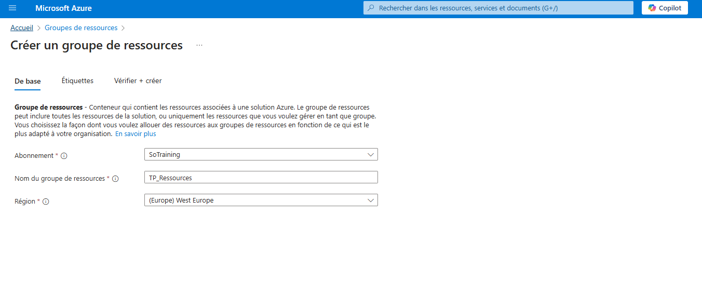
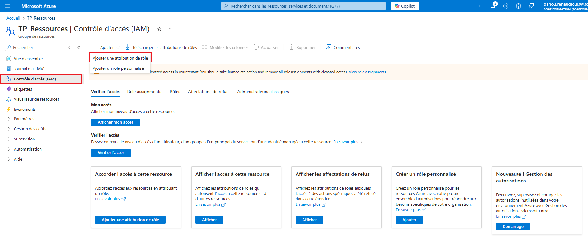
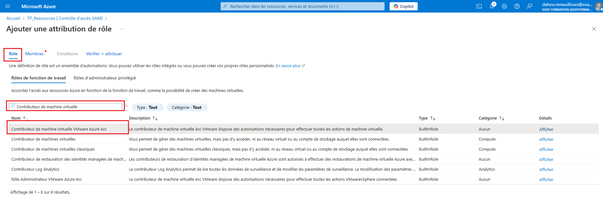
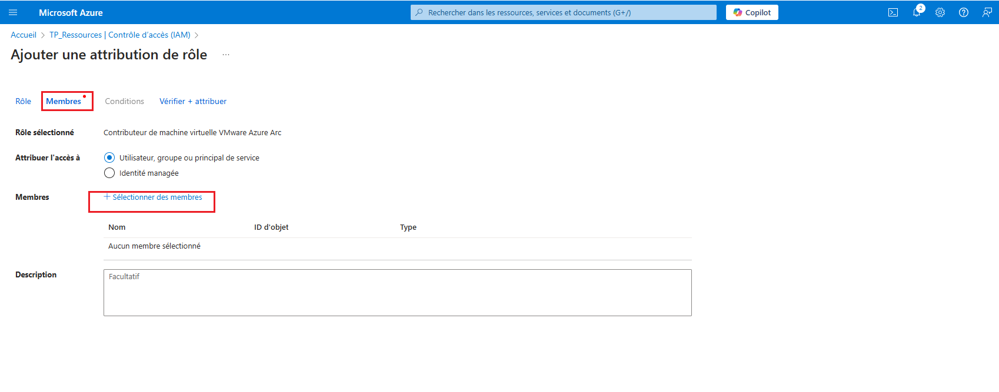
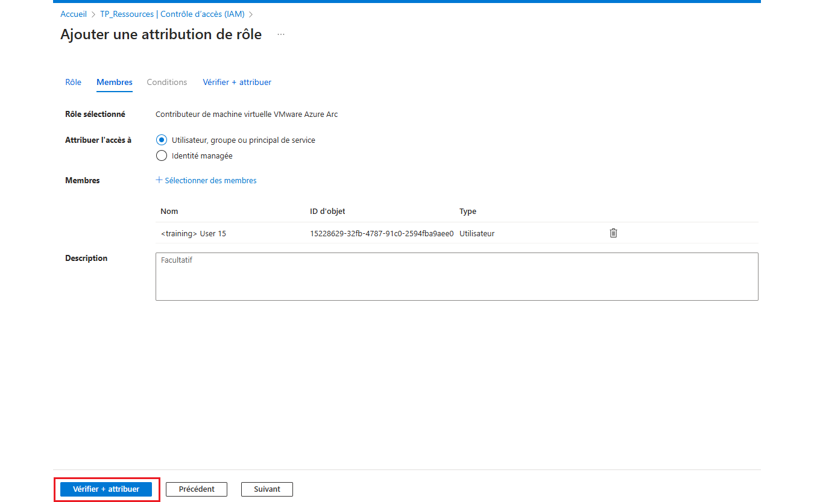
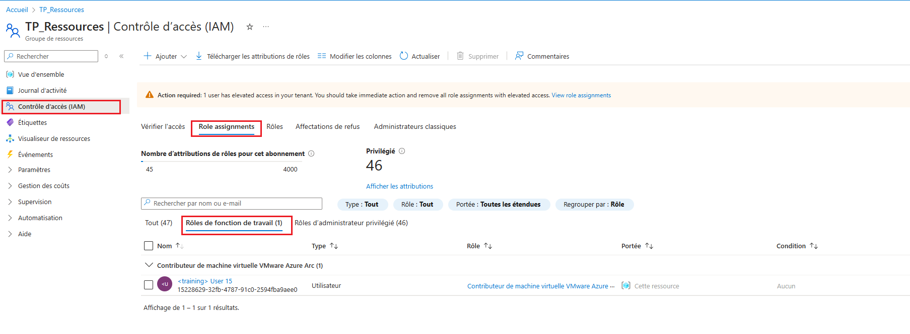

### Objectifs du TP :
- Comprendre les rôles intégrés et leur attribution dans Azure.
- Apprendre à contrôler les accès par niveaux (souscription, groupe de ressources, ressource).
- Mettre en place des rôles préconfigurés pour des machines virtuelles Azure.
- Appliquer les principes d'héritage des droits et gestion via des groupes/utilisateurs.

---

### Prérequis :
- Un abonnement Azure actif.
- Une machine virtuelle Azure.
- Accès au portail Azure (Azure Portal).
- Connaissances de base sur les concepts de contrôle des accès (IAM - Identity and Access Management).


**Créer un groupe de ressources** :

   - Allez dans **"Groupes de ressources"** et créez un groupe de ressources, par exemple "TP_Ressources".




**Attribuer des rôles aux utilisateurs** :

   - Allez dans le groupe de ressources créé et sélectionnez **"Contrôle d’accès (IAM)"**.
   - Cliquez sur **"Ajouter un rôle"**.
   - Sélectionnez le rôle approprié (par exemple, "Contributeur de machine virtuelle VMware Azure Arc").
   - Assignez ce rôle à un utilisateur spécifique ou à un groupe d'utilisateurs.








**Via Azure CLI**

````
###Attribuer un rôle à un utilisateur :
az role assignment create --assignee "john.doe@votreentreprise.onmicrosoft.com" --role "Contributeur de machine virtuelle" --scope /subscriptions/{subscription-id}/resourceGroups/{resource-group-name}

###Attribuer un rôle à un groupe :
az role assignment create --assignee "AdminsVM" --role "Contributeur de machine virtuelle" --scope /subscriptions/{subscription-id}/resourceGroups/{resource-group-name}


````


Contributeur de machine virtuelle

### Création d'une VM pour tester les permissions de l’utilisateur

````
az vm create --resource-group TP_Ressources --name MyVM --image Ubuntu2204 --admin-username azureuser --ssh-key-values "ssh-rsa AAAAB3NzaC1yc2EAAAADAQABAAABgQCXhkjJATVZ4gwS+cfk3UuUO3sY1J3NDuDOElTDicaAgAA6STmOIyhYMzjP0Cp0W7zhaXo9xHsCPJBGRSMH0I1ZtaqrGFQV43J7eOsrZ2bdzqCsbj8qstxxMigfaZ4ds9DSE8Od/KflNx/SWlgPCps8gJAfDtzvrmnbUB88h25ZboVHODkpeb3BhqeoNrG+qZ4bypgVqv8A/FpUqM/Tse43Tt743kY2KdF2HBHbXGfpHshtfTOI09qY77O6Ua3ew/ZyhoVUtBstQuhZZj67gqOt4aZS7iiqaxvFvpr7PWnqc7iHZfUGsh5HrBepwobod3ONneieLZypLBE6V6xTq7pHqa8eFVCZZtxCBk8tHIPd9WBxxvbsope1SOl5vbSjr2+iB6lL4We+PRUyuvyYZZIfpu+JECbYYOoef4uDgvpTnKRBTm4FsUwsFsArSnvdSuMxTUz7V3bVTYJxJuDRf0qxxeJI541yCMFjUWUpwY/uu8n9qFBUEeytzSXDI/fvyi0= generated-by-azure" --size Standard_DS1_v2
````

---

#### Modification de permission
Le but ici est de réduire les permissions

````
az role assignment list --assignee training-user-15@soatformation.onmicrosoft.com --all --output table                                                                                                                                   Principal                                       Role                             Scope
----------------------------------------------  -------------------------------  --------------------------------------------------------------------------------
training-user-15@soatformation.onmicrosoft.com  Azure Arc VMware VM Contributor  /subscriptions/2f8f37d3-c9e1-4092-bab8-7990c96abfe8/resourceGroups/TP_Ressources


az role assignment delete --assignee training-user-15@soatformation.onmicrosoft.com --role "Azure Arc VMware VM Contributor" --scope /subscriptions/2f8f37d3-c9e1-4092-bab8-7990c96abfe8/resourceGroups/TP_Ressources


az role assignment create --assignee training-user-15@soatformation.onmicrosoft.com --role "Virtual Machine Contributor" --scope /subscriptions/2f8f37d3-c9e1-4092-bab8-7990c96abfe8/resourceGroups/TP_Ressources
````


````

Attention:  Si l'utilisateur fait partir d'un group d'utilisateur qui a déja des permission élevé ça fonctionnera pas

etant donné qu'il apartient au groupe "Training Users" qui a un role "Owner" nous allons retiré cela d'abord


az ad user get-member-groups --id training-user-15@soatformation.onmicrosoft.com --output table

az ad group show --group "Training Users" --query "id" --output table

az role assignment list --assignee <Object-ID-du-groupe> --all --output table

az role assignment list --assignee c8492b57-07e1-4034-9dd0-577d65c8b6f2 --all --output table

az role assignment delete --assignee c8492b57-07e1-4034-9dd0-577d65c8b6f2 --role "Owner" --scope /subscriptions/2f8f37d3-c9e1-4092-bab8-7990c96abfe8

az role assignment create --assignee training-user-15@soatformation.onmicrosoft.com --role "Virtual Machine Contributor" --scope /subscriptions/2f8f37d3-c9e1-4092-bab8-7990c96abfe8/resourceGroups/TP_Ressources

````


## **🔹 Étape 3 : Tester les permissions de l’utilisateur**
### **1️⃣ Tester l’accès au portail Azure**
📌 **Connectez-vous avec l’utilisateur de test** :
1. Ouvrez une session avec l'utilisateur (ex. `training-user-15@soatformation.onmicrosoft.com`).

2. Accédez au [portail Azure](https://portal.azure.com/).

3. Naviguez vers **Groupes de ressources** → Sélectionnez le groupe contenant la VM.

4. **Vérifiez que l’utilisateur peut :**
   ✅ Démarrer / arrêter la machine virtuelle.  
   ✅ Modifier ses paramètres (ex. taille, étiquettes, extensions).  
   ✅ Supprimer la VM.  
   ❌ Ne peut pas supprimer VNet  

---