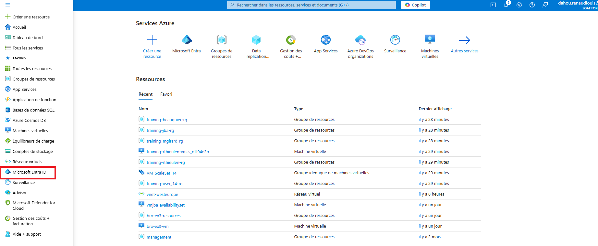

### Objectifs du TP :
- Comprendre les rôles intégrés et leur attribution dans Azure.
- Apprendre à contrôler les accès par niveaux (souscription, groupe de ressources, ressource).
- Mettre en place un groupe d'utilisateur avec un rôle (reader).

---

### Prérequis :
- Un abonnement Azure actif.
- Une machine virtuelle Azure.
- Accès au portail Azure (Azure Portal).
- Connaissances de base sur les concepts de contrôle des accès (IAM - Identity and Access Management).

**Créer un groupe d'dutilisateur** :

**Ajouter un utilisateur au groupe et lui atribué un role sur les ressource de l Organization** :

# OU 

