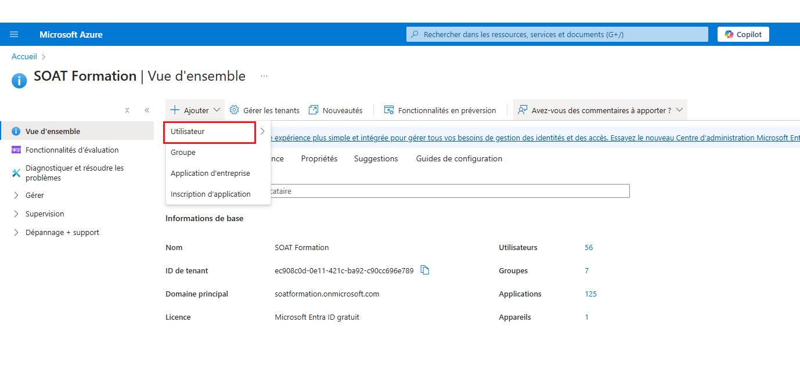
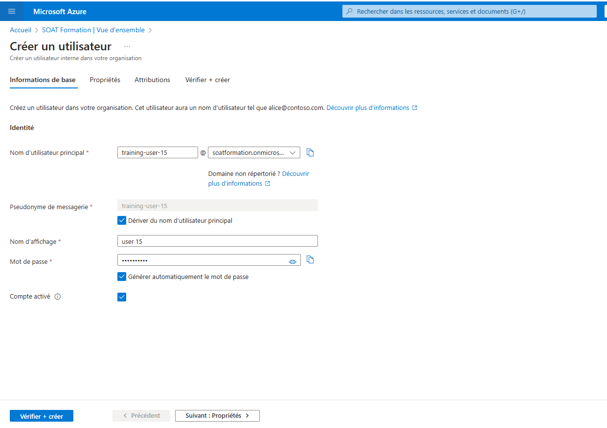
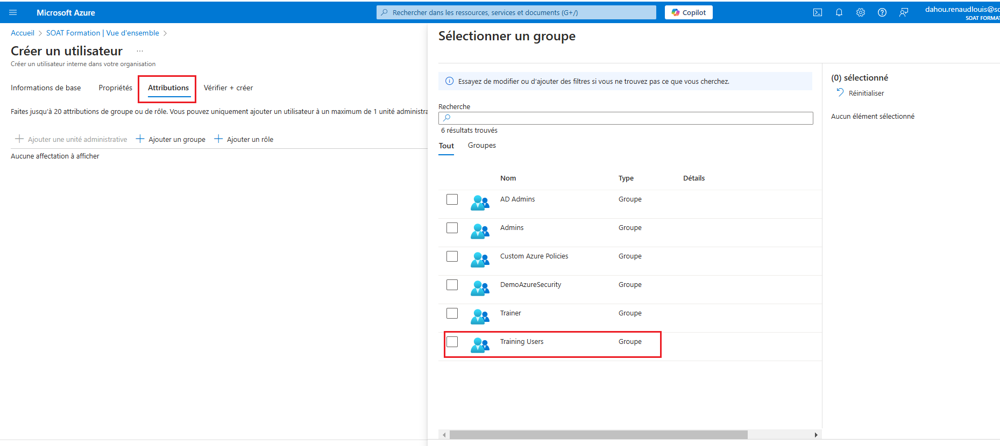
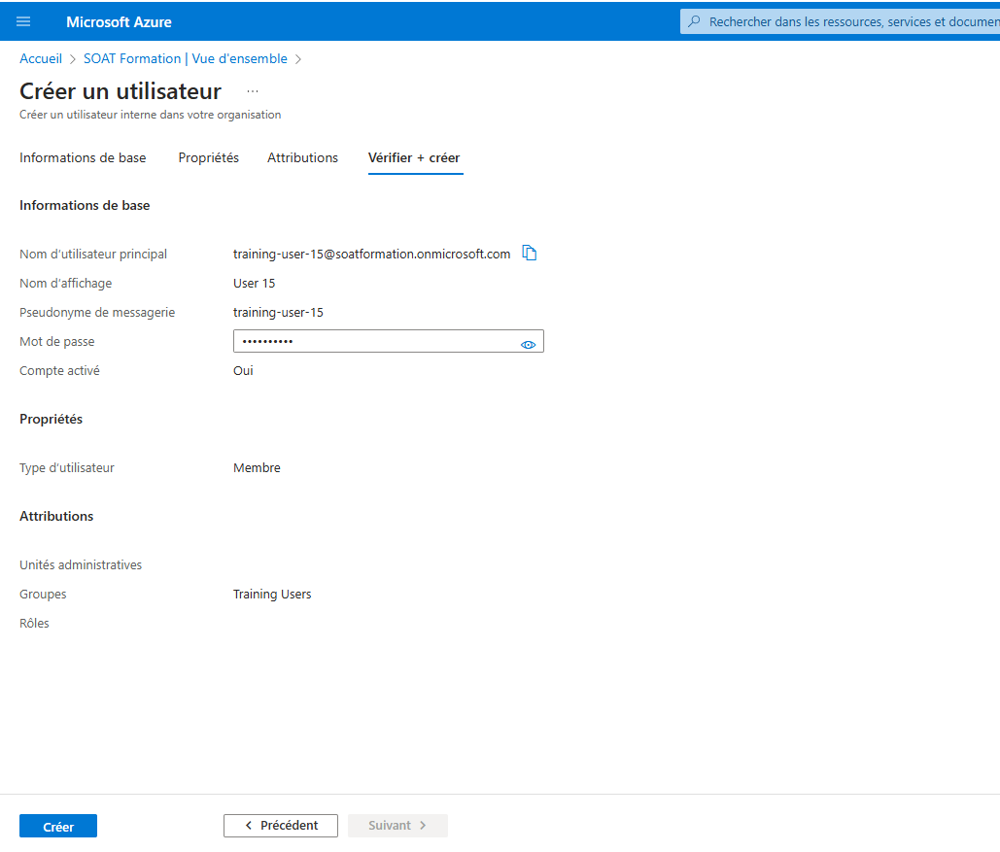

1. **Attribuer des rôles sur des groupes** :
   - Allez dans le groupe de ressources et attribuez un rôle à un **groupe d’utilisateurs** plutôt qu’à des utilisateurs individuels.
   - Les rôles attribués à un groupe se propageront à tous ses membres (héritage des droits).
   
2. **Vérification des héritages** :
   - Ajoutez un nouvel utilisateur à un groupe et vérifiez qu’il hérite des rôles attribués au groupe.
   - Modifiez un rôle d’un groupe et observez l'impact sur tous les utilisateurs du groupe.










```
az ad user create --display-name "Jean Dupont" --user-principal-name "jean.dupont@soatformation.onmicrosoft.com" --password "MotDePasse@123" --force-change-password-next-sign-in true

 az ad user show --id "jean.dupont@soatformation.onmicrosoft.com"

az ad group member add --group "Training Users" --member-id "c68d52dd-93e0-4a85-942d-34ec17b47455"

````